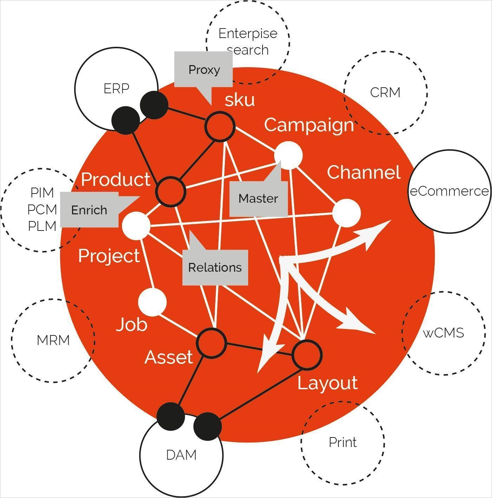

# ディフィニション

**エンティティ**

これを「モノ」や「コト」と呼び続けることもできますが、このドキュメントを通して使用する定義、つまり **エンティティ** を紹介します。

Sitecore Content Hubの世界でのエンティティとは、1つのデータとして一緒に属しているデータの集合体のことです。例：「製品」、「キャンペーン」、「プロジェクト」、「ストーリー」、「レシピ」、「ファイル」など。

エンティティの定義を始める際の典型的なルールは以下のようになります。"コンテンツを検索した際に検索結果として表示されるものは何でも、エンティティの候補になります。Sitecore Content Hubは、自社のマーケティング業務に関連した独自のエンティティを作成できるように設計されています。

前述したように、エンティティはSitecore Content Hub内にも、他のシステムにも存在することができます。他のシステムにあるエンティティにリンクする場合、私たちはそれを「プロキシエンティティ」と呼んでいます。プロキシエンティティは、他のエンティティと同様にSitecore Content Hub内で使用することができますが、そのエンティティのマスターデータのプロパティは他のシステムにあるため、本質的には読み取り専用となります。

**プロパティ**

エンティティは、エンティティの詳細を記述するプロパティで構成されています。例：「商品番号」、「特典」、「キャンペーン概要」、「ファイルサイズ」など。プロパティは、複数のデータ型（テキスト、数値、オプションリスト、はい/いいえ、日付など）で利用できます。このドキュメントの他の場所で全体のリストを見る）と、すべてのエンティティに自由に割り当てることができます。プロパティは、関連する場合には多言語にすることができます。

必要に応じて、エンティティに必要な数のプロパティを定義することができます。ユーザーは、ソース・システムでは利用できないプロパティをプロキシ・エンティティに追加で定義することもできます。プロキシエンティティはSitecore Content Hubでは編集できませんが、これらの追加プロパティは編集可能です。

**リレーション**

エンティティ間のリレーションは、マーケティングドメインモデルに意味を与えます。エンティティ間のリレーションを作成することで、データを重複させることなく、それぞれのエンティティをより定義し、より豊かにすることができます。レシピは複数の製品を使用することができます。キャンペーンには、ストーリーと関連ファイルを含めることができます。

リレーションズは検索エンジンを賢くし、コンテンツを閲覧する際に必要なコンテキストを与え、マーケティング担当者が素早く簡単にコンテンツを見つけられるようにします。

*リレーションズの例*

