# 画像の類似性

画像の類似性を分析して類似のアセットを特定して再利用や再目的化することで、新しいアセットを作成するために必要な時間とコストを節約できます。

画像の類似性は、コンテンツに基づいてアップロードされた画像に自動的にタグを付ける自動アセットタグ付けに依存しています。**タグ**、**説明**、および**色**のデータは、[画像解析](image-analysis.md)機能によって生成され、**アセット詳細**ページの画像解析セクションに表示されます。

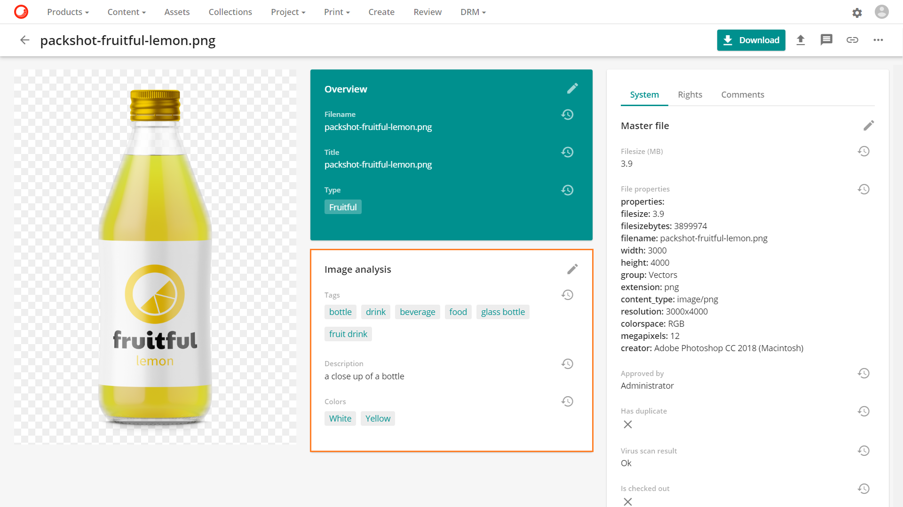

## 画像の類似性の設定

画像の類似性を設定するには

1. [この機能が有効になっているかどうかを確認する](#check-if-the-feature-is-enabled)
2. [画像の類似度設定を行う](#configure-the-image-similarity-settings)
3. [M.AssetTypeタクソノミーを設定](#set-up-the-massettype-taxonomy)
4. [類似アセット操作の設定（オプション）](#set-up-the-similar-assets-operation)

### <a name="check-if-the-feature-is-enabled" />機能が有効になっているかどうかを確認する

画像の類似性機能は、デフォルトでは無効になっています。

> [!Note]
> 画像類似機能を有効にするには、Sitecoreのアカウントマネージャーに連絡してください。

画像類似機能が有効になっているかどうかを確認するには

1. **管理** > **設定**に移動します。

  
  
2. **ImageSimilaritySystem**を検索します。

  

3. *ServiceEnabled* 設定が有効な場合は、お使いの環境で画像類似機能が有効になっています。そうでない場合は、有効ではありません。

  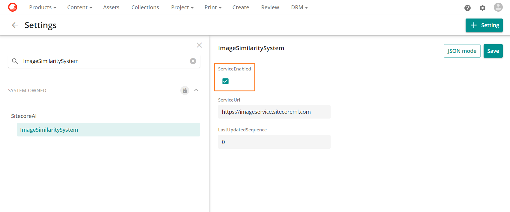

  > [!Warning]
  > * ImageSimilaritySystem の設定はシステムが所有しています。管理者のみが編集できます。
  > * ServiceEnabled設定が無効になっている場合、画像類似性機能を設定することはできず、類似アセットページを使用するとエラーが返されます。

### <a name="configure-the-image-similarity-settings" />画像の類似性設定を設定する

画像類似度機能には、画像類似度データを生成するためにアセットをSitecore AIに送信するための2つのモードがあります。

* **シングルアップロード** このモードでは、処理の準備ができたアセットを1つずつSitecore AIに送信します。
* **大量アップロード** このモードでは、処理可能なアセットの数が定義されたしきい値に達するまで待ってから、一括でSitecore AIに送信します。

*ImageSimilarity*設定は、機能の他の側面の定義に加えて、どのモードを使用するかを定義します。

ImageSimilarity設定を編集するには、**管理** > **設定**でImageSimilarityを検索します。*Sitecore AI*セクションにあります。

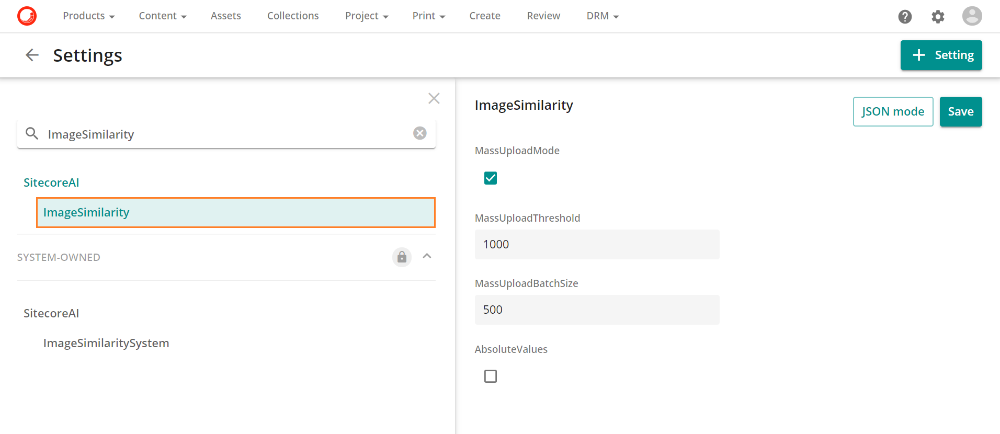

> [!Warning]
> * スーパーユーザーのみが ImageSimilarity の設定を編集できます。
> * 変更を行ったら、**保存** をクリックします。

次の表は、ImageSimilarity の各設定について説明しています。

| 設定 	| 説明 	|
|-	|-	|
| MassUploadMode 	| 機能のモードを定義します。大量アップロードモードを使用する場合は、このボックスにチェックを入れます。シングルアップロードモードを使用する場合は、このボックスをオフにします。	|
| MassUploadThreshold 	| Sitecore AIに送信する前に処理する準備ができているアセットの数のしきい値を定義します。この例では、Sitecore AIの処理を開始する前に1000のアセットを準備しておく必要があります。 	|
| MassUploadBatchSize 	| バッチごとにSitecore AIに送信するアセットの数を定義します。この例では、処理のためにアセットを500のバッチで送信しています。 	|
| AbsoluteValues 	| 類似アセットページに表示される信頼度レベルのバッジの形式を定義します。デフォルトでは、バッジはパーセンテージで表示されます。バッジを10進数で表示したい場合は、このボックスにチェックを入れます。 	|

次の表は、AbsoluteValues の設定に基づいて、信頼度レベルのバッジがどのように変化するかを示しています。スクリーンショットをクリックすると、フルスクリーンで表示されます。

| 設定値 	| バッジ 	|
|-	|-	|
| 	| 
	|
| 	| 
	|

> [!Note]
> 絶対値がどのように機能するかについての詳細は、信頼度を参照してください。

### <a name="set-up-the-massettype-taxonomy" />M.AssetType タクソノミーを設定する

画像類似性機能は、特定のアセット タイプを持つアセットにのみ適用されます。M.AssetType [タクソノミー](../../administration/data/taxonomies/taxonomy.md)を設定することで、イメージ類似性機能を起動するアセット・タイプを選択できます。既存のアセット タイプを選択するか、新しいアセット タイプを作成できます。

画像の類似性をトリガーするようにアセット タイプを設定したら、画像の類似性の比較に含めるアセットに割り当てることができます。

> [!Warning]
> スーパーユーザーのみが以下の手順を実行できます。

M.AssetType タクソノミーに新しいアセットタイプを追加し、画像の類似性をトリガーするように設定するには、以下の手順を実行します。

1. **管理** > **タクソノミー**に移動します。

  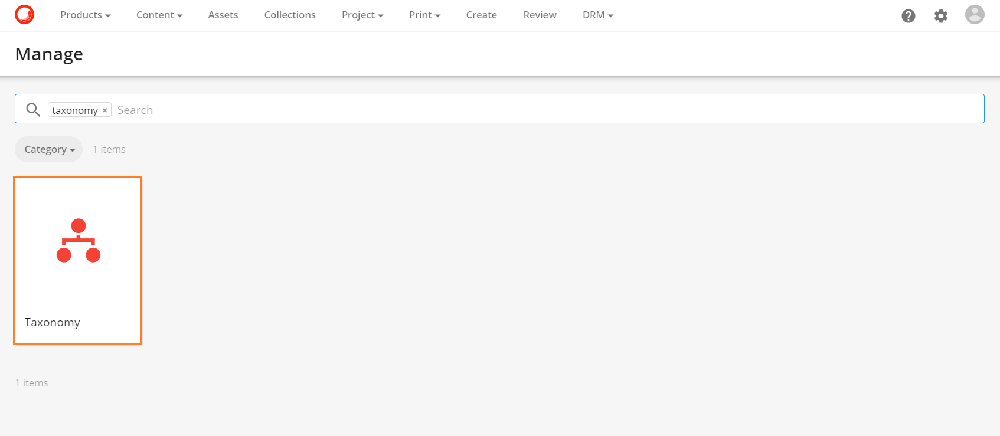

2. M.AssetTypeタクソノミーを検索して選択します。

  

3.  をクリックすると、新しいM.AssetTypeタクソノミー項目が追加されます。

4. **ラベル**を入力します。この例では、**ラベル**はImageSimilarityです。**識別子**は自動生成されます。

5. **Triggers vision**を*True*に設定します。

  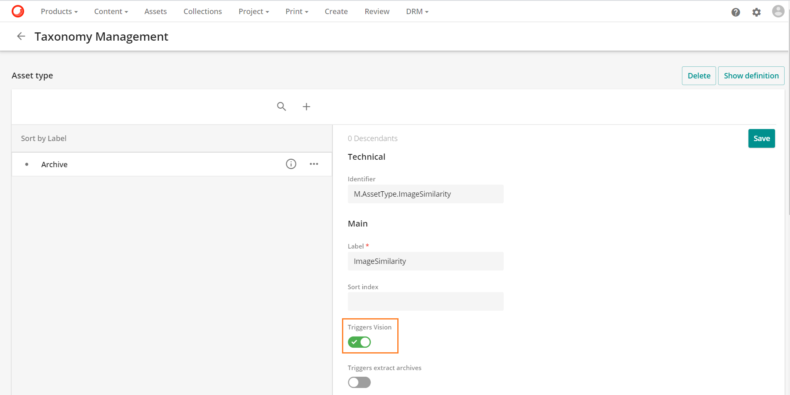

6. **Triggers 画像類似度**をTrueに設定します。

  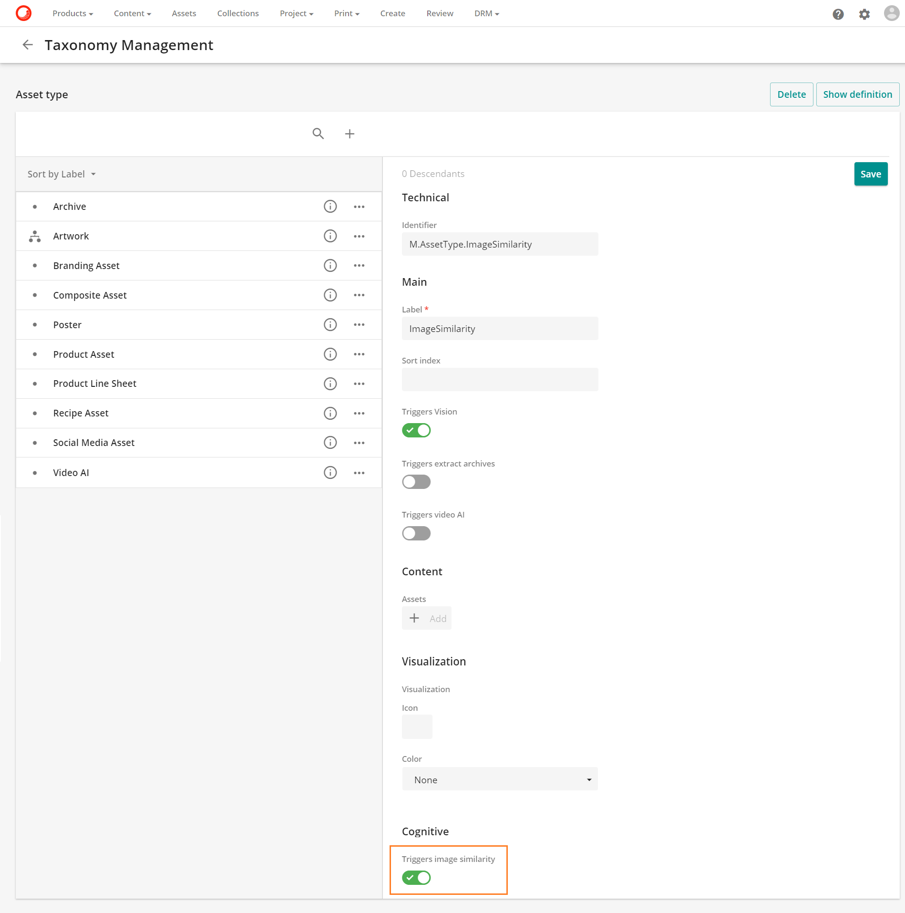

7. **保存**をクリックします。

> [!Warning] 
> ご利用の環境で画像類似機能が有効になっていない場合、この設定を保存することはできません。

### <a name="set-up-the-similar-assets-operation" /> 類似アセットの操作を設定する

お使いの環境で画像**類似機能を**有効にすると、**アセット詳細**ページに類似アセットの操作が自動的に追加されます。

**プロジェクトアセットの詳細**ページでこの機能を使用する場合は、ページ内で**類似アセット**の操作を設定する必要があります。

> [!Warning]
> スーパーユーザーのみが以下の手順を実行できます。

プロジェクトアセットの詳細ページで、類似アセットの操作を設定するには、以下の手順を実行します。

1. **管理** > **ページ**に移動します。

  

2. **アセット**ページ（**プロジェクト**ページの子）を探して選択します。

  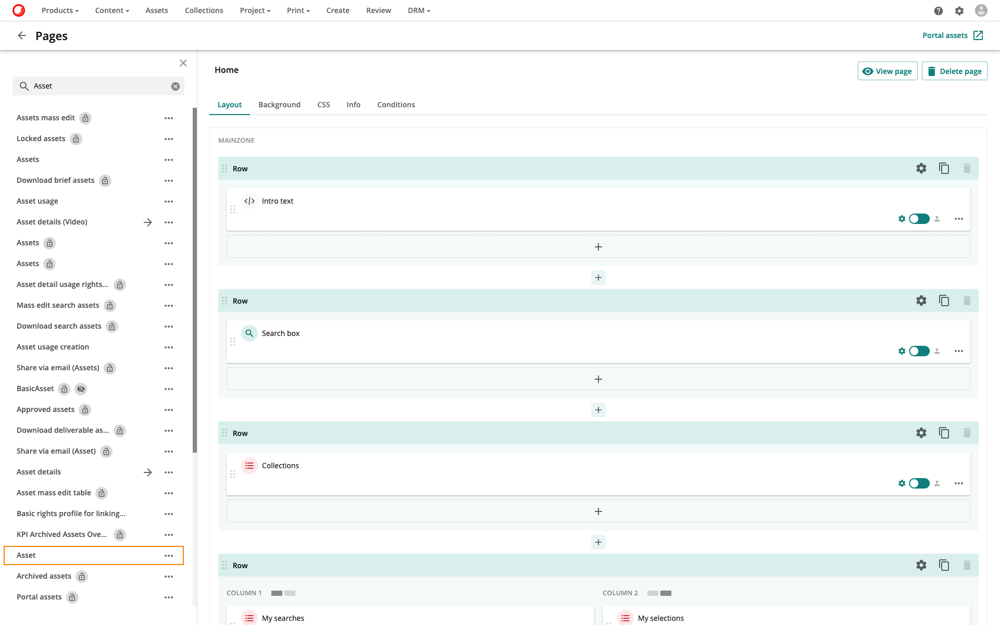

3. 必要に応じて、**エンティティ操作**コンポーネント（Operations）をカスタム設定モードを使用するように設定します 

  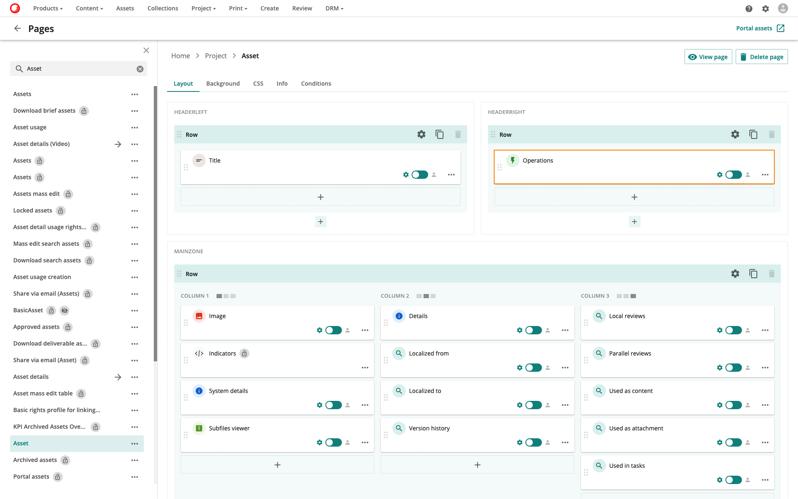

4. コンポーネント上で、アイコンをクリックして、Editを選択します。

  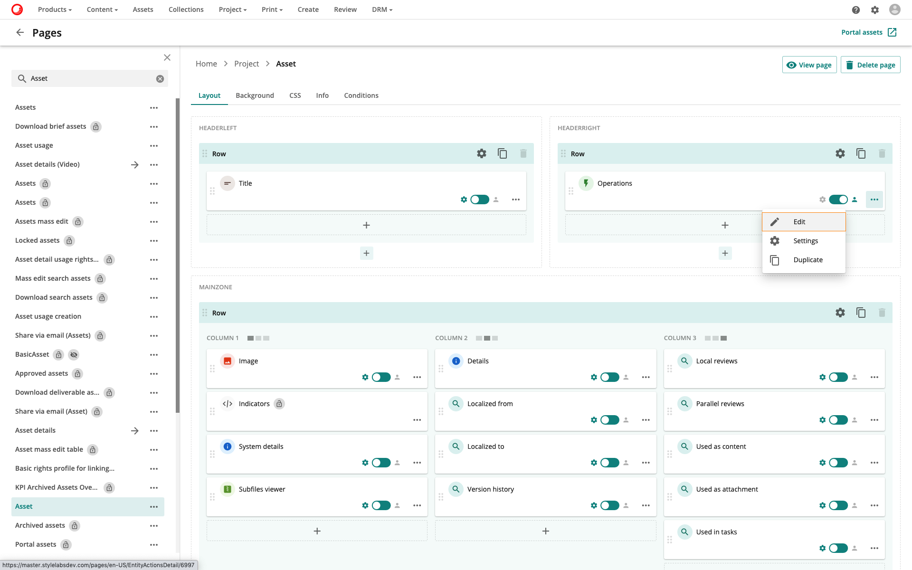

5. エンティティ操作コンポーネントで、**Add operation**をクリックします。

  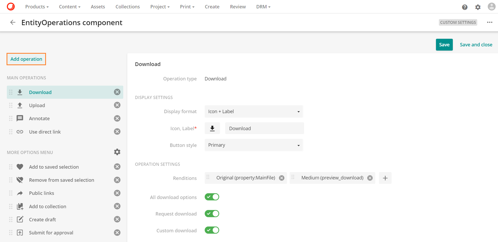

6. **ビューの詳細**を選択します。

  

7. **詳細表示**の操作を以下のように設定します。

  | フィールド  	| 値 	|
  |-	|-	|
  | 表示形式 	| アイコン＋ラベル 	|
  | アイコン、ラベル	| このアイコン虫眼鏡のアイコンを選択することができます。アイコンページ(m-icon-image-search)からIcon_Magnifier-glass.pngを選択し、ラベルとして類似のアセットを使用しています。
 	|
  | ボタンスタイル 	| 標準 	|
  | ページ名 	| SimilarAssets（操作を選択したときに開くページ) 	|
  | ウィンドウタイプ 	| 特大モーダル (SimilarAssetsページのモーダルウィンドウサイズ)	|

  > [!Note]
  > ページ名フィールド以外にも、必要に応じて他のフィールドの値を変更することができます。

8. 必要に応じて、このアイコン  の操作上のドラッグ機能を使用し、Similar assetsの操作を必要な位置にドラッグします。

  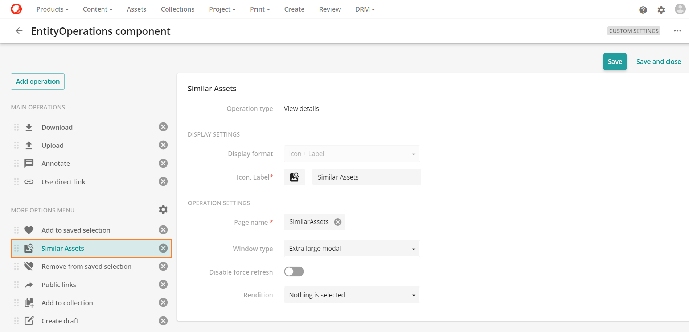

  > [!Tip]
  > メインの操作エリアに操作を移動する場合は、表示形式を「アイコン」に設定することをお勧めします。この場合、操作ラベルがツールチップとして表示されます。

9. **保存** をクリックします。

## 画像の類似性を利用する 

画像の類似性機能を使用するには

1. 画像の類似性機能を使用するには、**アセットの詳細**ページに移動して、その他のアクション をクリックします。

  

2. **類似アセット**のページでは、2つのタブが表示されます。

  * [類似タグ](#similar-tags-tab)
  * [同系色](#similar-colors-tab)

    

  > [!Note]
  > 類似タグと類似色は、[画像の類似度設定を有効](#set-up-the-massettype-taxonomy)にしたアセットでのみ利用可能です。

### <a name="similar-tags-tab" />類似タグタブ

このタブでは、Sitecore DAM内の類似タグを持つアセットを見つけることができます。

似たような色のタグは、アセットプレビューの下にある *類似アセット* ページで確認できます。

### <a name="similar-colors-tab" />類似色タブ

このタブでは、Sitecore DAM内の似たような色や説明を持つアセットを見つけることができます。

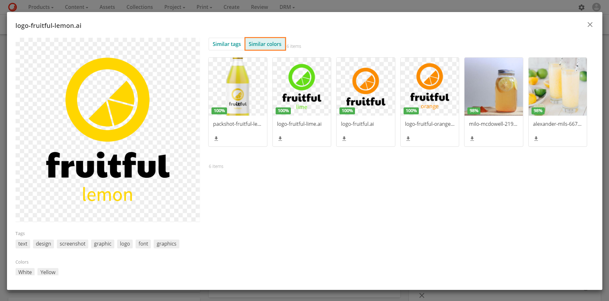

似たような色は、アセット プレビューの下にある「似たようなアセット」ページで確認できます。

> [!Note]
> 色の類似性は、類似色と類似の記述を組み合わせたものを基準にしています。

### 信頼度のレベル

類似アセットのページには、類似アセットの一致値（パーセント表示）を示す信頼度レベルのバッジがあります。

コンフィデンスレベルのバッジは以下のようにグループ化されています。

| 自信度 	| バッジの色 	|
|-	|-	|
| 99% - 80% (高類似度) 	| 	|
| 79% - 50% (中程度の類似度) 	|  	|
| 49% - 1% (Low similarity) 	|  	|

また、信頼度レベルのバッジを絶対値で表示することもできます。この場合、値の一致は小数点以下6桁で表示されます。

* これは、あなたのアセットから一致したアセットまでの距離を表します。

* 値が小さいほど、一致が近いことを示します。

* 距離がゼロの場合は、NA（該当なし）と表示されます。

  

  > [!Note]
  > 信頼度バッジのフォーマットは、画像類似度設定で設定できます。
