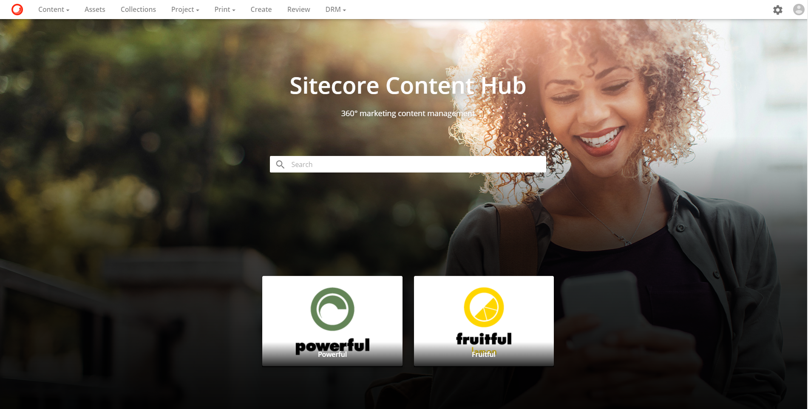

# ホームページとナビゲーション

ホームページは、ログインしたユーザーがデフォルトで到着する場所です。

彼らは、最も重要な領域に移動するために上部のメインナビゲーションを使用することができます。ユーザーの権限に応じて、多かれ少なかれメニュー項目が表示されます。

* **コンテンツ**: コンテンツ メニューオプションは、CMPモジュールのプレースホルダーとして機能します。CMPは、すべてのコンテンツとそのパフォーマンスの全体的なビューを提供する中心的なハブです。CMPの詳細については、[CMP](../../cmp/cmp-intro.md) を参照してください。
* **アセット**: アセットページの主な目的は、ユーザーが探しているアセットを見つけ、コンテンツの表示、編集、公開、ダウンロードを行うのを支援することです。
* **コレクション**: コレクションページには、ユーザーが作成した、またはユーザーと共有しているコレクションのリストが表示されます。コレクションの詳細については、[コレクション](../about-m-content/definitions/collections.md)を参照してください。
* **プロジェクト**: プロジェクトメニューは、プロジェクトまたはMRMモジュールへのアクセスを提供します。プロジェクトの詳細については、[MRM](../../marketing-resource-management/introduction.md)を参照してください。
* **印刷**: 印刷 モジュールは、資料の一部をカスタマイズしたり、結果として印刷可能な電子文書（印刷）を作成したりする機能を提供します。
* **作成**: 作成権限を持つユーザーは、新しいコンテンツをアップロードして作成することができます。
* **レビュー**: レビュー権限を持つユーザーは、提出されたコンテンツを承認/拒否することができます。
* **管理**: 管理ページは、ユーザーやユーザーグループの管理、データ管理、設定などの管理作業を目的としています。詳細については、[管理マニュアル](../../administration/introduction.md) を参照してください。
* **ユーザーページ**: 現在のユーザーの情報やアクションが含まれています。例えば、ユーザーがダウンロード注文を作成した場合、ダウンロード注文はダウンロード注文ページでアクセスできます。ユーザーページの詳細については、[ユーザーページ](../customize/user-pages-menu.md) を参照してください。

